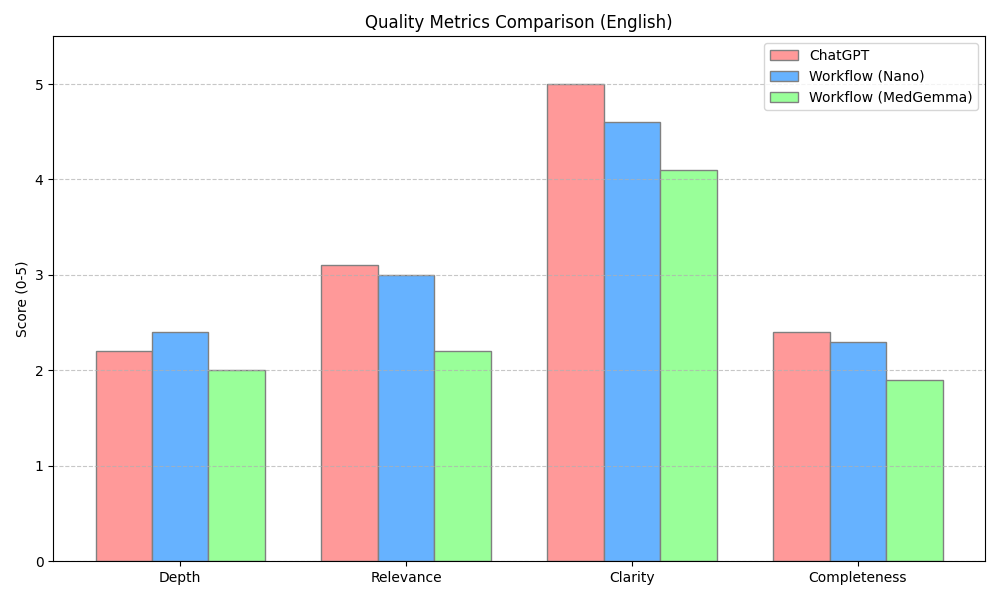
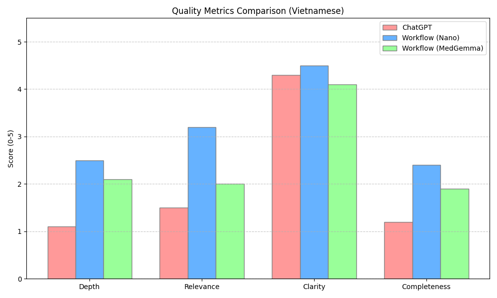
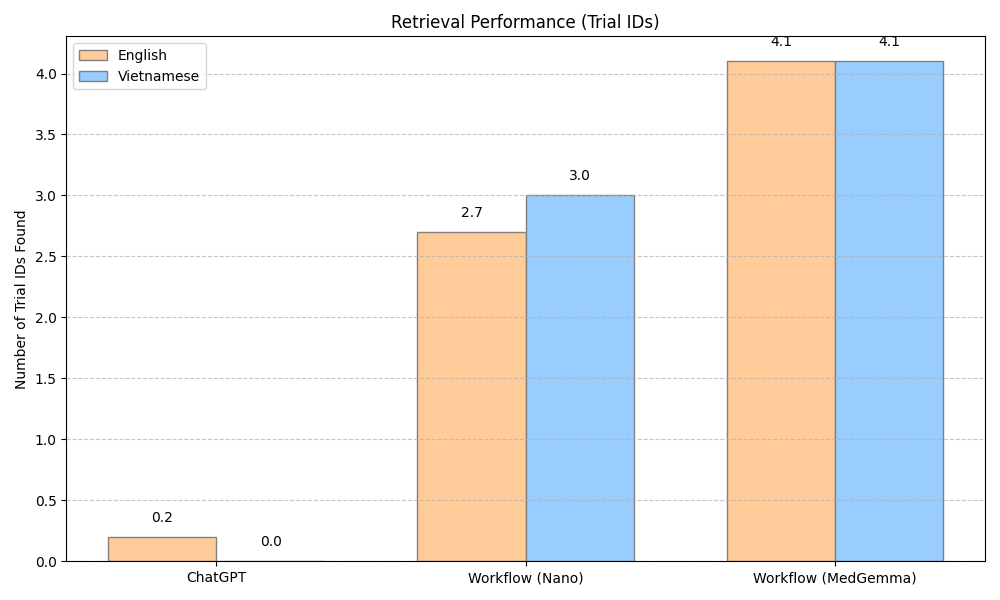
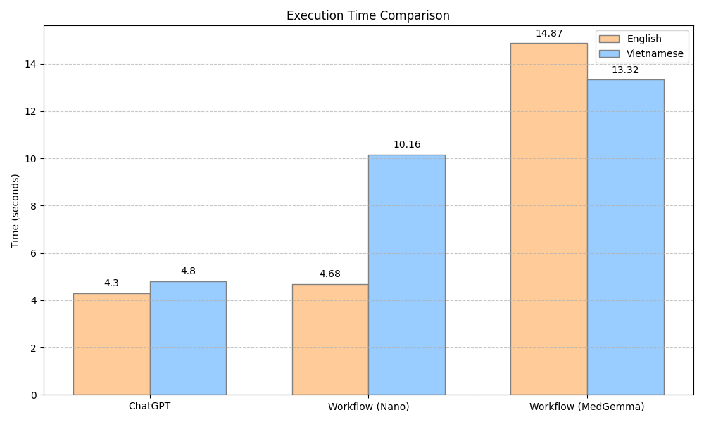
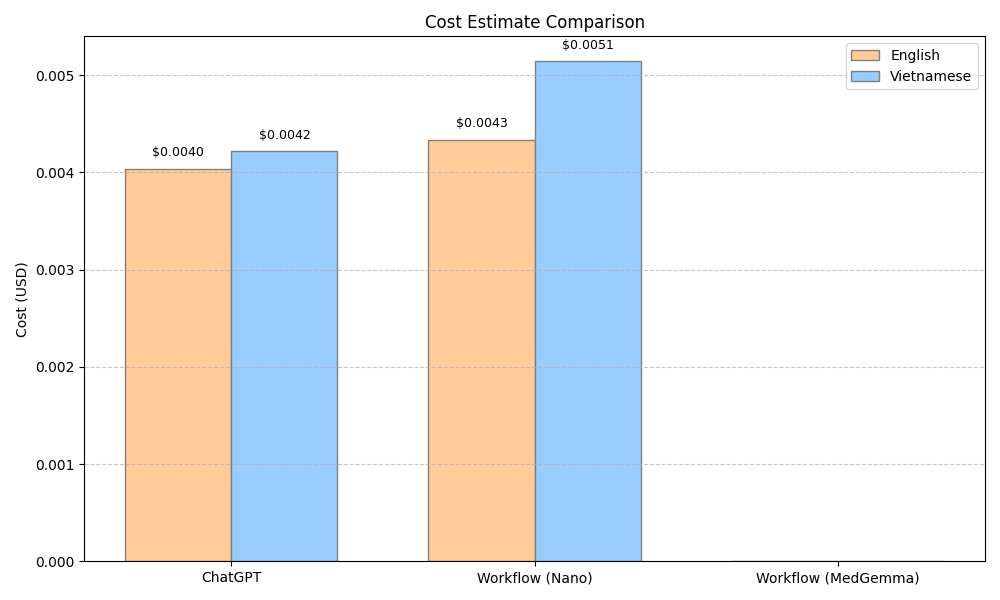

# Đánh giá chất lượng

## Tiếng Anh

| Tiêu chí | ChatGPT | Workflow (gpt-4.1-nano) | Workflow (medgemma-4b-it) |
| --- | --- | --- | --- |
| Số lượng Trial ID | 0.2 | 2.70 | 4.10 |
| Thời gian thực thi (giây) | 4.3 | 4.68 | 14.87 |
| Độ sâu (Depth) | 2.2 | 2.40 | 2.00 |
| Mức độ liên quan (Relevance) | 3.1 | 3.00 | 2.20 |
| Độ rõ ràng (Clarity) | 5.0 | 4.60 | 4.10 |
| Độ đầy đủ (Completeness) | 2.4 | 2.30 | 1.90 |
| **Token Usage** |  |  |  |
| Avg Prompt Tokens | 146.8 | 1257.5 | 1384.9 |
| Avg Completion Tokens | 635.7 | 408.0 | 699.2 |
| Avg Total Tokens | 782.5 | 1665.5 | 2084.1 |
| Total Prompt Tokens | 1468 | 12575 | 13849 |
| Total Completion Tokens | 6357 | 4080 | 6992 |
| Total Tokens | 7825 | 16655 | 20841 |
| **Cost Estimate (Total)** |  |  |  |
| Total Cost (USD) | $0.004034 | $0.004334 | $0.000000 |

## Tiếng Việt

| Tiêu chí | ChatGPT | Workflow (gpt-4.1-nano) | Workflow (medgemma-4b-it) |
| --- | --- | --- | --- |
| Số lượng Trial ID | 0.0 | 3.00 | 4.10 |
| Thời gian thực thi (giây) | 4.8 | 10.16 | 13.32 |
| Độ sâu (Depth) | 1.1 | 2.50 | 2.10 |
| Mức độ liên quan (Relevance) | 1.5 | 3.20 | 2.00 |
| Độ rõ ràng (Clarity) | 4.3 | 4.50 | 4.10 |
| Độ đầy đủ (Completeness) | 1.2 | 2.40 | 1.90 |
| **Token Usage** |  |  |  |
| Avg Prompt Tokens | 199.7 | 1280.2 | 1388.6 |
| Avg Completion Tokens | 652.6 | 537.0 | 778.5 |
| Avg Total Tokens | 852.3 | 1817.2 | 2167.1 |
| Total Prompt Tokens | 1997 | 12802 | 13886 |
| Total Completion Tokens | 6526 | 5370 | 7785 |
| Total Tokens | 8523 | 18172 | 21671 |
| **Cost Estimate (Total)** |  |  |  |
| Total Cost (USD) | $0.004215 | $0.005142 | $0.000000 |

## Biểu đồ trực quan

### 1. Chất lượng (Quality Metrics)
**Tiếng Anh:**

**Tiếng Việt:**

### 2. Hiệu quả tìm kiếm (Retrieval Performance)

### 3. Thời gian thực thi (Execution Time)

### 4. Chi phí (Cost Estimation)

## Kết luận

Dựa trên kết quả thực nghiệm, có thể rút ra một số nhận xét quan trọng:

1. **Hiệu quả tìm kiếm (Retrieval):** 
   - Hệ thống Workflow (cả `gpt-4.1-nano` và `medgemma-4b-it`) vượt trội hoàn toàn so với ChatGPT tiêu chuẩn về khả năng trích xuất thông tin cụ thể (Trial ID). 
   - `medgemma-4b-it` đạt hiệu suất tìm kiếm ID cao nhất (trung bình 4.1 ID), trong khi ChatGPT gần như không tìm thấy thông tin hữu ích (0.0 - 0.2 ID).

2. **Chất lượng nội dung:**
   - **Workflow (gpt-4.1-nano)** là mô hình cân bằng tốt nhất. Nó đạt điểm số cao nhất về Mức độ liên quan (Relevance), Độ sâu (Depth) và Độ đầy đủ (Completeness), đặc biệt là với Tiếng Việt.
   - **ChatGPT** có ưu thế về tốc độ và văn phong (Độ rõ ràng cao), nhưng thất bại trong việc cung cấp nội dung chuyên sâu và chính xác cho bài toán cụ thể này.
   - **Workflow (medgemma-4b-it)** tuy tìm được nhiều dữ liệu đầu vào nhất nhưng khả năng tổng hợp và diễn giải (Relevance, Completeness) thấp hơn so với các mô hình thương mại.

3. **Hiệu năng và Chi phí:**
   - **Về tốc độ:** ChatGPT nhanh nhất, tiếp theo là Workflow (gpt-4.1-nano). Model open-source `medgemma` chạy chậm hơn đáng kể (gấp 2-3 lần).
   - **Về chi phí:** `medgemma-4b-it` là giải pháp miễn phí. Workflow (gpt-4.1-nano) có chi phí cao hơn ChatGPT một chút do lượng context (prompt tokens) lớn hơn để xử lý workflow, nhưng mang lại giá trị nghiệp vụ cao hơn hẳn.

**Tóm lại:** 
Để xây dựng trợ lý ảo hỗ trợ tìm kiếm thử nghiệm lâm sàng, việc sử dụng **Workflow tích hợp model chuyên biệt (như gpt-4.1-nano)** là hướng đi đúng đắn. Nó khắc phục được điểm yếu trầm trọng của ChatGPT trong việc tra cứu dữ liệu thực tế, đồng thời cung cấp chất lượng câu trả lời tốt hơn nhiều so với các mô hình ngôn ngữ nhỏ (SLM) tự host như MedGemma, đặc biệt là trong bối cảnh ngôn ngữ tiếng Việt.
