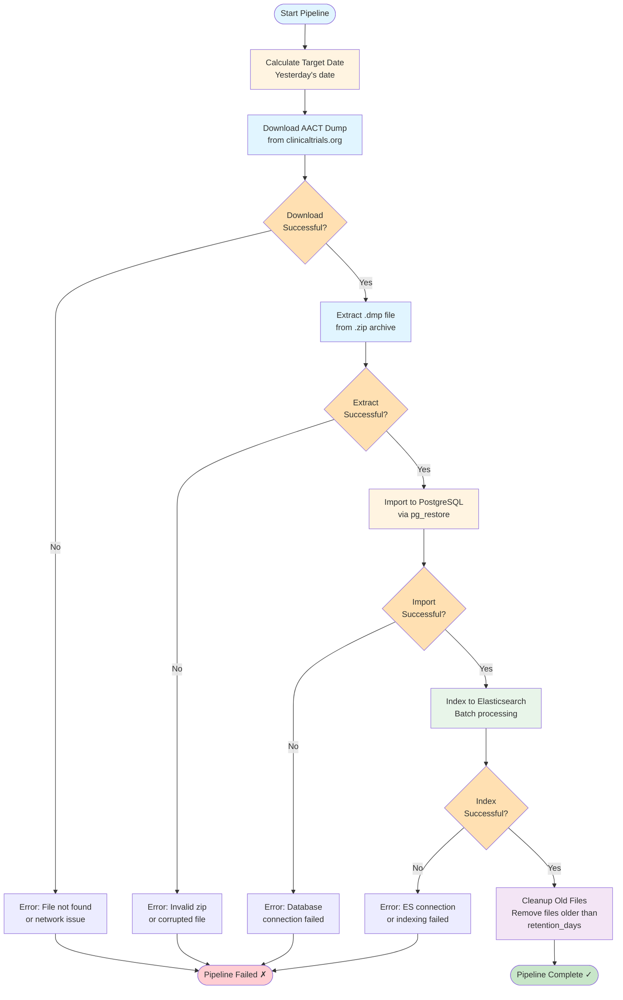

# AACT Data Pipeline

Automated pipeline for downloading, importing, and indexing AACT clinical trial database snapshots.

## Overview

The pipeline performs the following steps:

1. **Download**: Fetches AACT database dump from clinicaltrials.org (previous day's snapshot)
2. **Import**: Imports the dump file into PostgreSQL database
3. **Index**: Indexes the data from PostgreSQL to Elasticsearch for full-text search
4. **Cleanup**: Removes old dump files to save disk space

## Pipeline Workflow



## Requirements

- Python 3.12+
- PostgreSQL (Docker container recommended)
- Elasticsearch 7.x
- Dependencies: see `../pyproject.toml`

## Configuration

Edit `config.yaml` to customize:

```yaml
aact:
  download_dir: "./data/downloads"  # Where to save dumps
  retention_days: 7                 # How many days to keep old dumps

postgres:
  container_name: "postgres_db"
  database: "aact"

elasticsearch:
  index_name: "trec2023_sql"
  batch_size: 50000
```

## Usage

### Run Full Pipeline

Download yesterday's data and process it:

```bash
python data_pipeline/pipeline.py
```

### Run for Specific Date

```bash
python data_pipeline/pipeline.py --date 2025-12-31
```

### Run Individual Steps

Download only:
```bash
python data_pipeline/download_aact.py
```

Import only (requires .dmp file):
```bash
bash data_pipeline/import_aact_data.sh data/downloads/20251231_clinical_trials.dmp
```

Index only:
```bash
python data_pipeline/sql2es.py
```

### Skip Steps

```bash
# Skip download (use existing dump)
python data_pipeline/pipeline.py --skip-download

# Skip import (data already in PostgreSQL)
python data_pipeline/pipeline.py --skip-download --skip-import

# Skip cleanup (keep all old files)
python data_pipeline/pipeline.py --skip-cleanup
```

## Scheduling

To run the pipeline automatically every day, you can:

### Option 1: Cron (Unix/Linux/Mac)

Add to crontab (`crontab -e`):

```bash
# Run at 2 AM every day
0 2 * * * cd /path/to/trial-assitant && python data_pipeline/pipeline.py >> logs/pipeline_cron.log 2>&1
```

### Option 2: GitHub Actions

Create `.github/workflows/update-aact-data.yml`:

```yaml
name: Update AACT Data
on:
  schedule:
    - cron: '0 2 * * *'  # Run at 2 AM UTC daily
  workflow_dispatch:  # Allow manual trigger

jobs:
  update-data:
    runs-on: ubuntu-latest
    steps:
      - uses: actions/checkout@v3
      - name: Run pipeline
        run: python data_pipeline/pipeline.py
```

## Troubleshooting

### Download fails with 404

The AACT database may not be available for the target date (weekends/holidays). Try a different date or wait for the next update.

### PostgreSQL connection fails

Ensure your PostgreSQL container is running:
```bash
docker-compose up -d postgres
```

### Elasticsearch indexing is slow

Large datasets can take 1-2 hours. You can adjust the batch size in `config.yaml`:

```yaml
elasticsearch:
  batch_size: 100000  # Increase for faster indexing
```

### Out of disk space

The dump files are large (2-5 GB). Adjust retention settings:

```yaml
aact:
  retention_days: 3  # Keep fewer days
```

## File Structure

```
data_pipeline/
├── config.yaml              # Pipeline configuration
├── download_aact.py         # Download AACT dumps
├── import_aact_data.sh      # Import to PostgreSQL
├── sql2es.py                # Index to Elasticsearch
├── pipeline.py              # Main orchestrator
└── README.md                # This file

data/
└── downloads/               # Downloaded dump files

logs/                        # Pipeline logs
```

## Notes

- AACT database is updated daily, but snapshots are typically for the previous day
- Full pipeline takes 1-2 hours depending on hardware
- Elasticsearch reindexing will temporarily impact search performance
- Consider running during off-peak hours (e.g., 2-4 AM)
