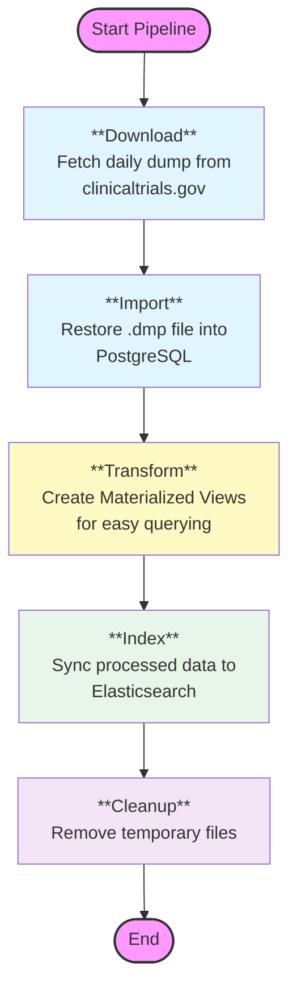

# Data Pipeline

The data pipeline is a critical component that ensures the Clinical Trial Assistant has access to the latest clinical trial data from ClinicalTrials.gov. It automates the process of downloading, cleaning, and indexing the AACT (Aggregate Analysis of ClinicalTrials.gov) database.

## Pipeline Workflow

The pipeline operates in four main stages, orchestrated to run sequentially.



## Detailed Steps

### 1. Download (`download_aact.py`)
- **Source**: Connects to the AACT web server.
- **Action**: Identifies the latest available database dump (typically from the previous day).
- **Output**: Downloads a ZIP file containing the PostgreSQL dump (`.dmp`).

### 2. Import (`import_aact_data.sh`)
- **Tool**: Uses `pg_restore` utility.
- **Action**: Restores the downloaded dump into a local PostgreSQL container.
- **Schema**: Populates the `ctgov` schema with raw tables identical to the AACT structure.

### 3. Transformation (`create_materialized_view.py`)
- **Objective**: Simplify complex joins and aggregations required for the search index.
- **Action**: Creates or refreshes materialized views in PostgreSQL. These views denormalize data, combining trial info, conditions, and locations into single records suitable for indexing.

### 4. Indexing (`sql2es.py`)
- **Source**: Reads from the optimized materialized views in PostgreSQL.
- **Destinations**: Elasticsearch.
- **Process**: 
    - Batches checks (e.g., 50,000 records at a time).
    - Maps SQL data types to Elasticsearch schema.
    - Performs bulk indexing operations.
- **Outcome**: A searchable Elasticsearch index (e.g., `trec2023_ctnlp`).

## Configuration

Configuration is managed via `data_pipeline/config.yaml`.

```yaml
aact:
  download_dir: "./data/downloads"
  retention_days: 7

postgres:
  container_name: "postgres_db"
  database: "aact"

elasticsearch:
  index_name: "trec2023_sql"
  batch_size: 50000
```

## Scheduling

The pipeline is designed to be idempotent and can be scheduled via `cron` or CI/CD workflows (e.g., GitHub Actions) to run daily, ensuring the assistant always serves fresh data.

```bash
# Example Cron: Run at 2 AM daily
0 2 * * * cd /app && python data_pipeline/pipeline.py
```
