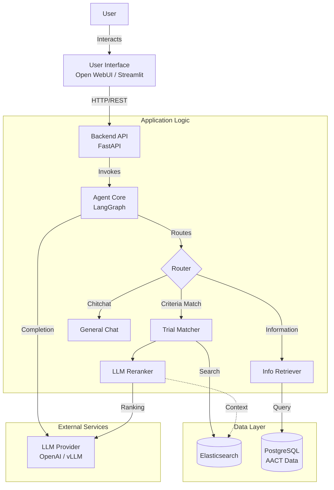

# System Design

## Architecture Overview

The Clinical Trial Assistant is built as a modular system with a clear separation of concerns between the user interface, the API layer, the intelligent agent core, and the data infrastructure.

## Core Components

### 1. User Interface (UI)
The system supports multiple frontend interfaces:
- **Open WebUI**: A robust, chat-like interface running in Docker, communicating with the backend via OpenAI-compatible endpoints.
- **Streamlit**: Used for specific tools or visualizations (e.g., benchmark visualization).
- **CLI**: Command-line tools for development and testing.

### 2. Backend API (`src/api`)
Built with **FastAPI**, the backend exposes REST endpoints. It acts as the gateway to the core logic.
- **Endpoints**: Standard OpenAI-compatible `/v1/chat/completions` for easy integration with existing LLM tools.
- **Streaming**: Supports Server-Sent Events (SSE) for real-time token streaming.

### 3. Agent Core (`src/core`)
The heart of the application is a **LangGraph** workflow that manages the conversation state and logic.
- **State Management**: Maintains conversation history and context.
- **Routing**: intelligently determines user intent (e.g., searching for a trial vs. asking a general medical question).
- **Graph Nodes**:
    - **Reception**: Initial intent classification.
    - **Search**: Queries Elasticsearch for relevant trials.
    - **Rerank**: Uses an LLM to re-evaluate search results against the user's specific patient profile for higher accuracy.
    - **Synthesize**: Generates the final natural language response.

### 4. Data Layer (`src/storage`, `data_pipeline`)
- **Elasticsearch**: Stores indexed clinical trial data for fast full-text search and filtering. Optimized for retrieval based on medical conditions, locations, and other criteria.
- **PostgreSQL**: Hosted the raw AACT (Aggregate Analysis of ClinicalTrials.gov) database. Used as the source of truth for the data pipeline.

### 5. External Services
- **LLM Provider**: The system is designed to be model-agnostic, supporting OpenAI's GPT models or self-hosted models (like via vLLM) through standardized API calls.

## Technology Stack

| Component | Technology | Description |
|-----------|------------|-------------|
| **Language** | Python 3.12+ | Core programming language |
| **Framework** | FastAPI | High-performance web API framework |
| **Agent Orchestration** | LangGraph | State machine based agent framework |
| **Search Engine** | Elasticsearch | Distributed search and analytics engine |
| **Database** | PostgreSQL | Relational database for raw data storage |
| **LLM Interface** | OpenAI SDK | Standard client for LLM interaction |
| **Containerization** | Docker | Application deployment and isolation |
| **Package Manager** | uv | Fast Python package installer and resolver |
