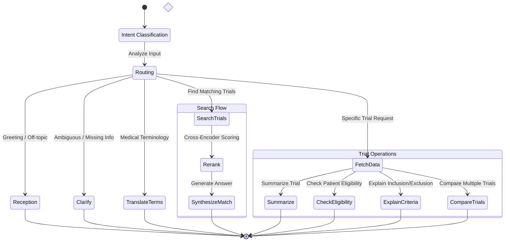

# Agent Workflow Logic

The core of the Clinical Trial Assistant is an intelligent agent built with **LangGraph**. This agent manages the conversation state, routes user requests to appropriate specialized handlers, and maintains context across multiple turns.

## Conversation State

The agent maintains a typed state object (`GraphState`) throughout the conversation lifecycle. This state serves as the "memory" of the current interaction.

| State Field | Type | Description |
|-------------|------|-------------|
| `messages` | List | History of user and assistant messages (Chat History). |
| `intent_type` | Enum | The classified goal of the user (e.g., `FIND_TRIALS`, `SUMMARIZE_TRIAL`). |
| `patient_info` | String | Extracted patient profile (age, condition, etc.). |
| `trial_ids` | List | Extracted trial IDs (e.g., NCT01234567) for specific lookups. |
| `trial_data` | List | Detailed clinical trial documents fetched from the database. |
| `reranked_results`| List | Search results after being scored by the LLM reranker. |

## Workflow Diagram

The following diagram illustrates the decision logic and flow of execution within the agent.

## Node Descriptions

### 1. Intent Classification (`intent_classification`)
**Role:** The "Brain" of the router.
- **Input:** User message + Conversation History.
- **Action:** Uses an LLM with structured output to classify the user's intent and extract entities (Patient Info, Trial IDs, Location).
- **Output:** Updates `intent_type` and extracted entities in the state.

### 2. Matching Workflow
When the user wants to find trials (`FIND_TRIALS`):
- **Search (`search`)**:
    - Queries Elasticsearch using the extracted `patient_info` and `location_info`.
    - Retrieves candidate trials (Top-K) based on keywords and filters.
- **Rerank (`rerank`)**:
    - A critical step for accuracy. The LLM acts as a **Cross-Encoder**, reading the `patient_info` and the `eligibility_criteria` of each candidate trial.
    - Assigns a relevance score (0-100) and rationale.
- **Synthesize (`synthesize`)**:
    - Takes the top-ranked trials and generates a helpful, natural language response for the patient.

### 3. Trial Operations Workflow
When the user asks about specific trials (e.g., "Summarize NCT123"):
- **Fetch Data (`fetch_trial_data`)**:
    - Queries PostgreSQL to get full details for the requested `trial_ids`.
- **Router**: Dispatches to the specific task node:
    - **Summarize (`summarize_trial`)**: Generates a concise overview of the trial(s).
    - **Check Eligibility (`check_eligibility`)**: Compares specific patient details against the trial's criteria.
    - **Explain Criteria (`explain_criteria`)**: Translates complex medical inclusion/exclusion rules into plain English.
    - **Compare (`compare_trials`)**: Creates a side-by-side comparison of 2+ trials.

### 4. Support Nodes
- **Reception**: Handles "Hello", "How are you", or off-topic questions without invoking search tools.
- **Clarify**: If the `intent_classification` determines data is missing (e.g., user asks "Am I eligible?" but hasn't provided their age/condition), this node generates a polite question to gather the missing info.
- **Translate Terms**: Explains specific medical jargon defined in the user's query.

## Memory & Persistence

The graph utilizes a **Checkpointer** (PostgreSQL-based in production, Memory-based in dev) to save the state after every step. This allows for:
- **Multi-turn conversations**: The agent remembers previous search results or patient details.
- **Human-in-the-loop**: Potential for human review or approval steps (future roadmap).
- **Resiliency**: If a step fails, it can be retried from the saved checkpoint.
